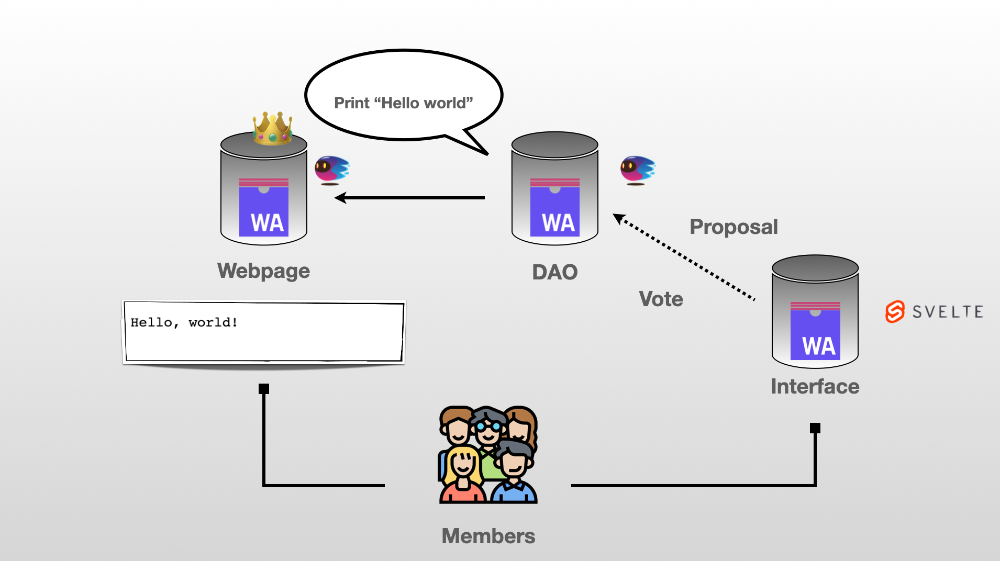

# 👻 Motoko Bootcamp 2023 

A huge thanks to [Iri](https://twitter.com/iriasviel) (ex-Motoko Bootcamp student | Motoko dev at Finterest) for contributing to the core project. 
You can use this repository as a starter point for your the [core project](https://github.com/motoko-bootcamp/motokobootcamp-2023) of [Motoko Bootcamp 2023](https://github.com/motoko-bootcamp/motokobootcamp-2023).

<p align="center">  </p>

A few more things:
- To build the core project you should complete the code that is missing inside the [src](./src/) folder.
- Using this skeleton is NOT a requirement. This repository is only meant to help you get started. 
- The core project has to be submitted before the deadline - more infos on #submit.
- [Plug wallet is used] and we recommend to use it for this core project to make your life easier:
    - Principal for users will be the same between canisters.
    - You can use it from the webpage to interact with your canisters.
- You should be able to use this repository for both local & mainnet development.

## Instructions to deploy localy
Start your local replica and make sure you don't have files from previou instances by adding the --clean flag.
```
dfx start --clean
```
Install the necessary packages.
```
npm run install
```


